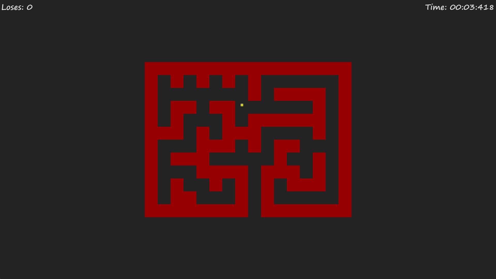
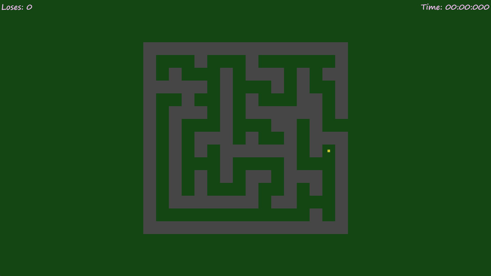
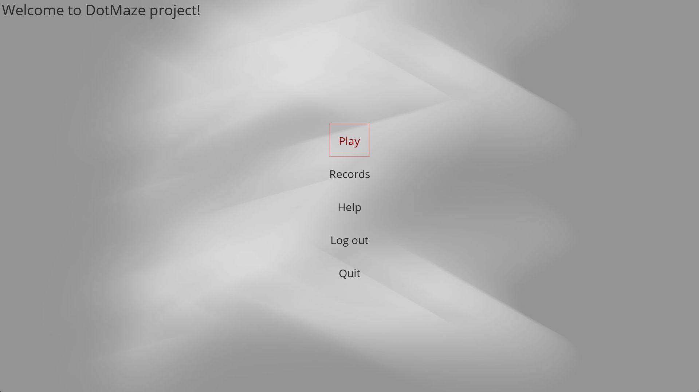
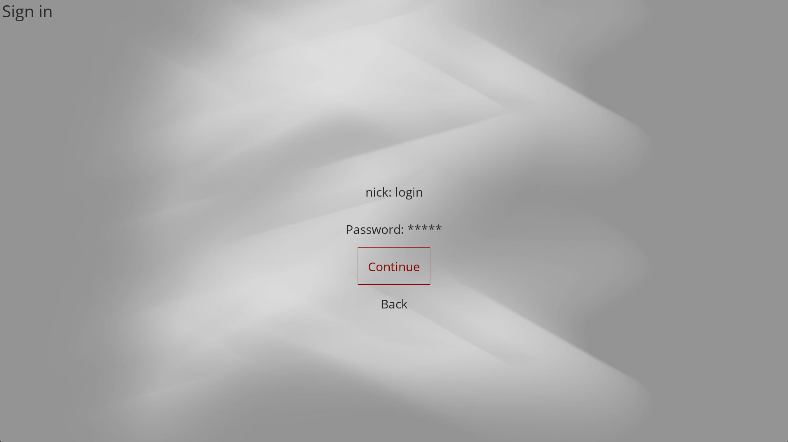
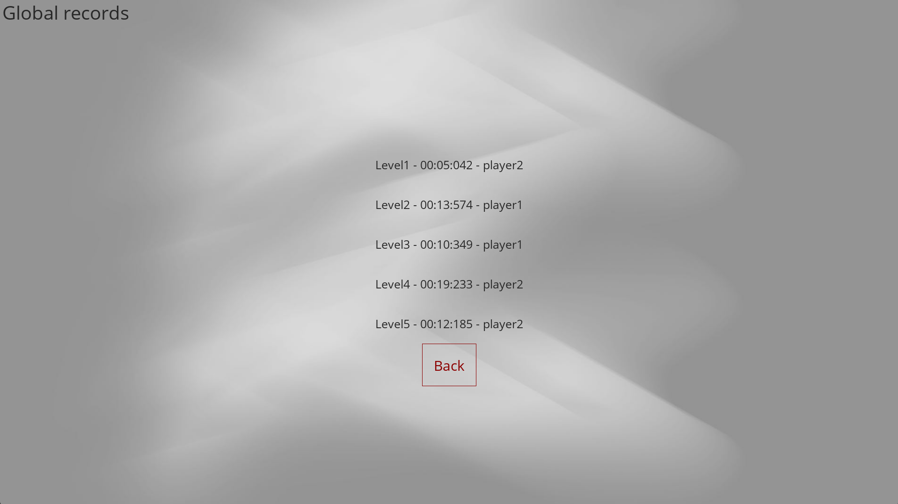

# 🧩 MazeGame — Classic Maze Game in Python

**MazeGame** is a lightweight 2D maze game built with **Python** and **Pygame**.  
Players navigate through designed mazes, collect time records, and progress through levels — all wrapped in a simple interface with logging, menu, timer, and user profiles.

It’s a showcase of **event-driven gameplay**, **collision handling**, and **menu-based UI logic** in Pygame.

> **License:** `CC0-1.0` *(see [LICENSE](LICENSE) for details)*

---

## ⚙️ Technologies

### Runtime
- **Python** 3.12–3.14  
- **Pygame** — 2D game engine  
- **SQLite3** — persistent user & record storage  
- **logging** — structured runtime logs  

### Production / Development
- **Poetry** — dependency & package management  
- **requirements.txt / requirements-dev.txt** — pip installation  
- **MkDocs** — documentation site (`docs/`, `mkdocs.yml`)  
- **pre-commit** — code formatting & linting (Black, Ruff, mypy)  
- **CI/CD** — GitHub Actions (`.github/workflows/*.yml`)  
- **PyInstaller** — executable build (`Mazegame.spec`)  
- **Black** — formatting  
- **Ruff** — linting  
- **mypy** — static type checking  

---

## 🧠 Overview

**MazeGame** combines fast-paced maze-solving with lightweight account handling and score tracking.  
It offers an intuitive menu system, dynamic levels, and persistent record storage.

---

## ✨ Features

- 🎮 **Dynamic Maze Levels** – progressively harder mazes drawn programmatically.  
- 👤 **User Login & Registration** – local account system stored in SQLite.  
- 🧾 **Score Records** – personal best times saved and displayed.  
- ⏱️ **Timer & Leaderboard** – finish times tracked and ranked.  
- 🧱 **Collision Detection** – smooth movement and obstacle interactions.  
- 🧭 **Pause Menu & Help Screen** – easily accessible during gameplay.  
- 🪶 **Custom Fonts & Theming** – personalized visuals with `segoeprb.ttf` and custom backgrounds.  

---

## 🗂️ Project Structure

```
## 🗂️ Project Structure

MazeGame/
├─ .gitignore                        # Git ignore rules
├─ .pre-commit-config.yaml           # pre-commit hooks (Black, Ruff, mypy, etc.)
├─ LICENSE                           # License (see contents for terms)
├─ Mazegame.spec                     # PyInstaller build specification
├─ README.md                         # Project readme
├─ mkdocs.yml                        # MkDocs site configuration
├─ poetry.lock                       # Poetry lockfile
├─ pyproject.toml                    # Poetry project config (deps, tools)
├─ requirements-dev.txt              # dev dependencies
├─ requirements.txt                  # runtime dependencies

├─ .github/
│  └─ workflows/
│     ├─ build.yml                   # Build workflow (package/test build)
│     ├─ ci.yml                      # CI workflow (lint, tests)
│     └─ release.yml                 # Release workflow (PyInstaller, publish artifacts)

├─ docs/                             # Documentation (MkDocs site content)
│  ├─ index.md                       # Project introduction (homepage)
│  ├─ css/
│  │  ├─ mkdocstrings.css            # Styling for mkdocstrings plugin
│  │  └─ theme-variants.css          # Additional theme variants
│  └─ gen_ref_pages/                 # Scripts for generating API reference pages
│     ├─ config.py                   # Config for generating API reference pages
│     ├─ context.py                  # Context helpers for mkdocstrings generation
│     ├─ generate.py                 # Entry script to generate reference pages
│     ├─ gen_ref_pages.py            # CLI wrapper for reference generation
│     ├─ helpers.py                  # Utilities for Markdown/page generation
│     └─ traverse.py                 # Module traversal for API docs

├─ screenshots/                      # Screenshots for README
│  ├─ main_menu.png                  # Main Menu screenshot (used in README)
│  ├─ gameplay_screen.png            # Gameplay screen screenshot
│  └─ records_board.png              # Records board screenshot

├─ src/
│  └─ mazegame/                      # Game package
│     ├─ __main__.py                 # Entry point (python -m mazegame)
│     ├─ app.py                      # Pygame app bootstrap: init, screen registry, launch first screen
│     ├─ logging_config.py           # Color-aware UTC logging setup (console/file)
│     │
│     ├─ assets/                     # Static assets bundled with the game
│     │  ├─ databases/               # SQLite databases
│     │  │  ├─ accounts.db           # SQLite DB: user accounts / credentials
│     │  │  └─ records.db            # SQLite DB: game records / highscores
│     │  ├─ fonts/                   # Fonts
│     │  │  └─ segoeprb.ttf          # Font used in UI
│     │  └─ img/                     # Images/icons
│     │     ├─ icon.ico              # Windows icon
│     │     ├─ icon.png              # App icon
│     │     └─ theme.jpg             # Background / theme image
│     │
│     ├─ maze_creator/               # Maze generation & level data
│     │  ├─ draw_maze.py             # Draw maze grid/tiles onto surface
│     │  ├─ get_number_of_levels.py  # Return available level count
│     │  └─ levels.py                # Level definitions/layouts
│     │
│     ├─ menu/                       # UI screens (menus)
│     │  ├─ help.py                  # Help screen
│     │  ├─ initial_menu.py          # Initial menu screen
│     │  ├─ login.py                 # Login screen
│     │  ├─ menu_when_login.py       # Main menu when user logged in
│     │  ├─ pause.py                 # Pause screen
│     │  ├─ records.py               # Records / highscores screen
│     │  ├─ register.py              # Register user screen
│     │  ├─ show_result_board.py     # Post-game result board
│     │  ├─ window_settings.py       # Window size / settings dialog
│     │  └─ menu_manager/            # Screen registry & navigation
│     │     ├─ menu_manager.py       # Screen router: navigate between screens
│     │     └─ set_screens.py        # Register and map screen names to classes
│     │
│     ├─ player/                     # Player-related code
│     │  └─ player.py                # Player entity: movement/state
│     │
│     └─ utils/                      # Utilities/helpers used across the app
│        ├─ collisions/              # Collision detection & resolution
│        │  ├─ collision_handling.py # Resolve collisions (axis-aligned) for player/maze
│        │  └─ get_collision_list.py # Build collidable tiles list for a rect/entity
│        │
│        ├─ databases/               # Lightweight DB helpers (SQLite)
│        │  └─ records_database.py   # CRUD helpers for highscores/records
│        │
│        ├─ display/                 # Display/window helpers
│        │  ├─ create_display.py     # Initialize Pygame display/window
│        │  └─ render_display.py     # Render frame & flip buffers
│        │
│        ├─ gameplay/                # Gameplay helpers
│        │  ├─ events_handling.py    # Pygame event handling (keys, quit) during gameplay
│        │  ├─ finish_handling.py    # Handle win/lose and end-of-level state
│        │  ├─ open_new_level.py     # Open next level / transition logic
│        │  └─ start_game.py         # Start game session: loop setup, transitions
│        │
│        ├─ global_variables/        # Global shared state
│        │  └─ global_variables.py   # Singleton for shared global state
│        │
│        ├─ paths/                   # Resource path helpers
│        │  └─ paths.py              # Resolve resource paths (dev vs packaged)
│        │
│        ├─ save_records/            # Records persistence
│        │  └─ save_records.py       # Persist scores to DB
│        │
│        └─ time/                    # Time/clock utilities
│           ├─ clock.py              # Pygame clock wrapper / tick helpers
│           └─ convert_time.py       # Format/convert time utilities
```

---

## 🔧 Installation

### Option A — pip

**Users (runtime only):**
```bash
python -m venv .venv
source .venv/bin/activate    # macOS/Linux
.venv\Scripts\activate       # Windows

pip install --upgrade pip
pip install -r requirements.txt
pip install -e .
```

**Developers (runtime + dev):**
```bash
pip install -r requirements.txt -r requirements-dev.txt
pip install -e .
```

---

### Option B — Poetry

**Users (without dev):**
```bash
poetry install --without dev
poetry run mazegame
```

**Developers (with dev):**
```bash
poetry install
poetry run mazegame
```

---

## ▶️ Running the Game

### From source
```bash
python -m mazegame
```

### With Poetry
```bash
poetry run mazegame
```

### After installation
```bash
mazegame
```

---

## 🧩 Gameplay Overview

1. **Login or Register** to start playing.  
2. Navigate the **maze** using keyboard controls.  
3. Avoid walls and find the **exit** as quickly as possible.  
4. Your **time is recorded** and added to the local scoreboard.  
5. Progress to the next level for more challenging mazes.  

---

## 🛠️ Developer Tools

### Type checking
```bash
mypy src/
```

### Linting
```bash
ruff check src/
```

### Auto-formatting
```bash
black src/
```

### Run all pre-commit hooks locally
```bash
pre-commit run --all-files
```

---

## 🖼️ Screenshots
- **Gameplay Screen:**

- **Gameplay Screen 2:**

- **Main Menu:**

- **Login Menu:**

- **Records Board:**
  


---

## 📜 License

Released under **CC0-1.0 (public domain)**.  
You may copy, modify, distribute, and use it commercially without asking for permission.  
